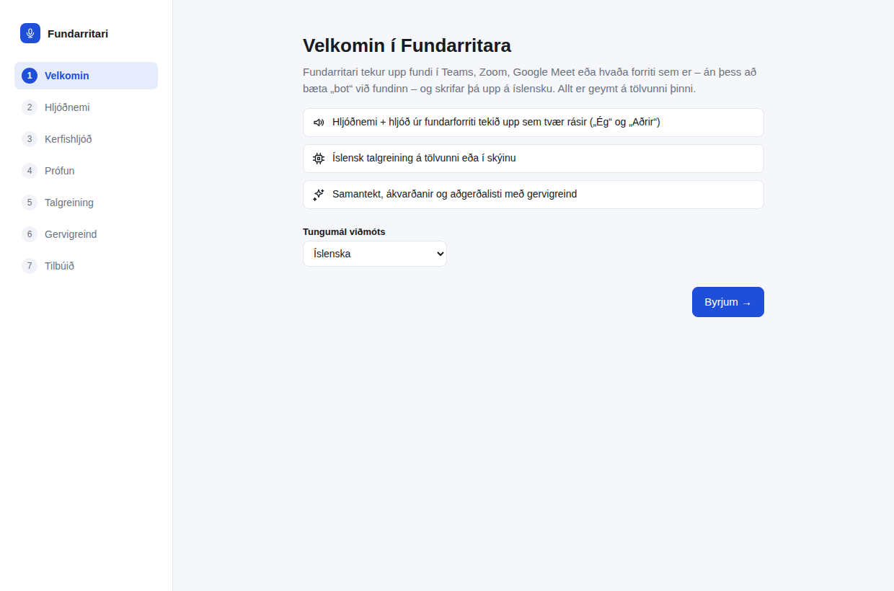
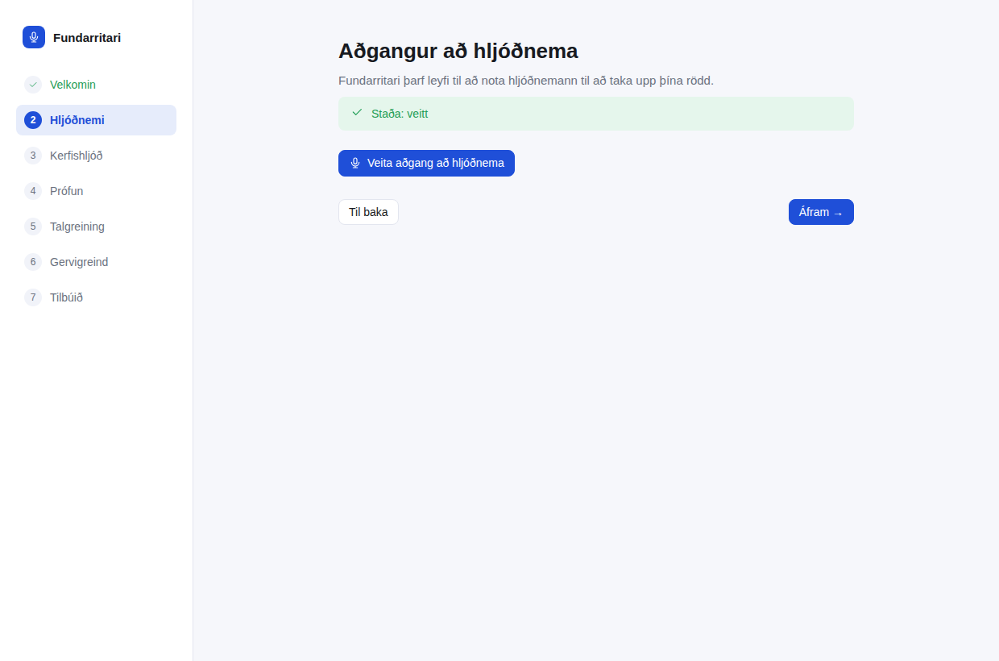
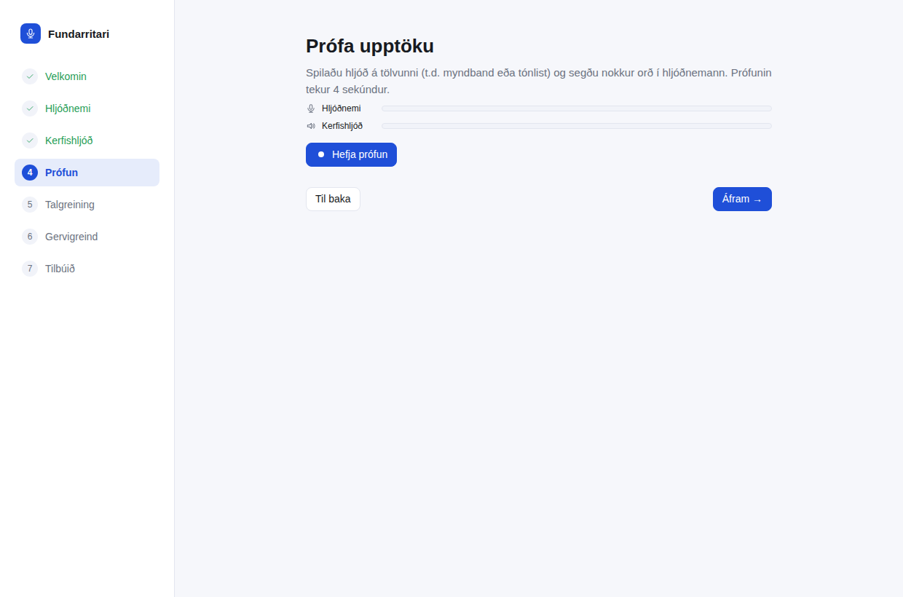
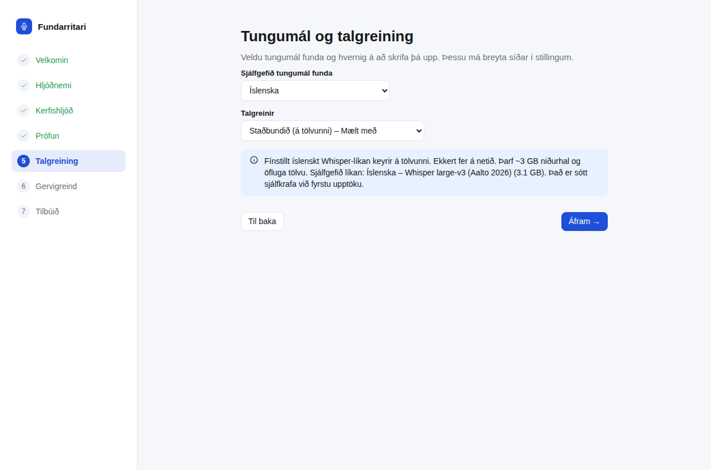
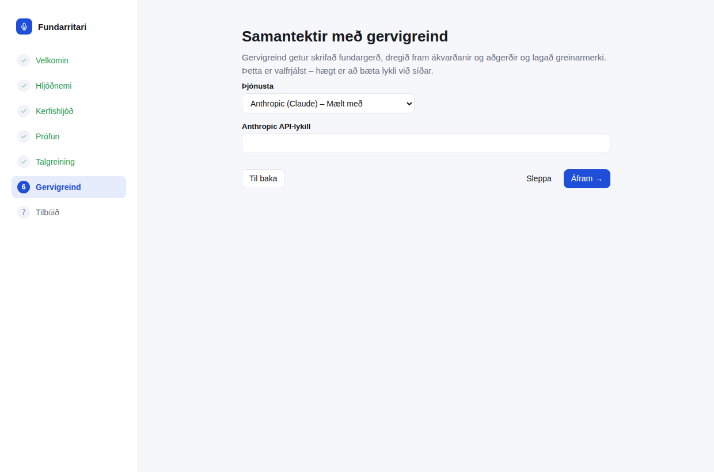
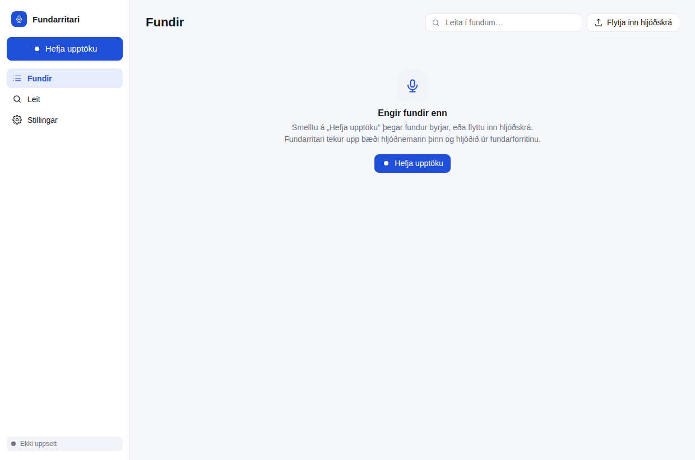
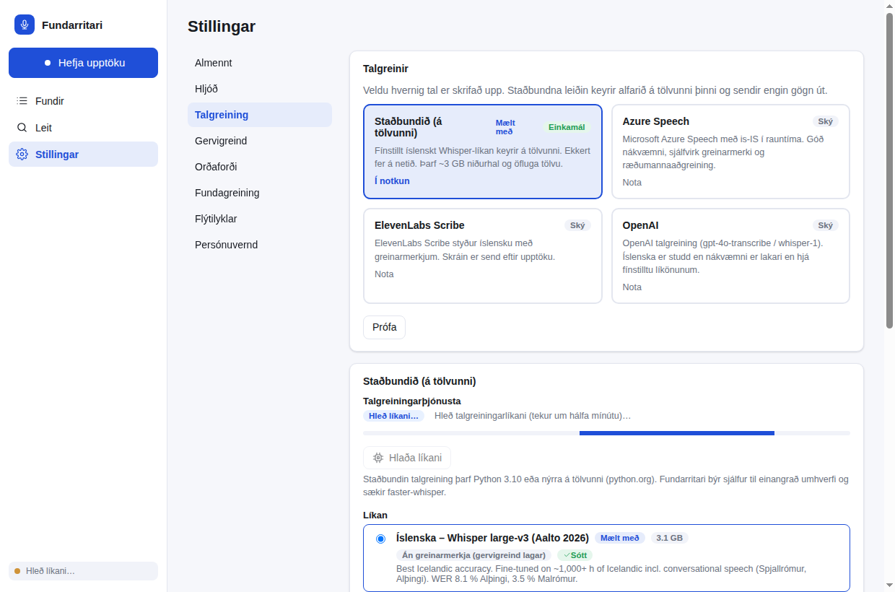
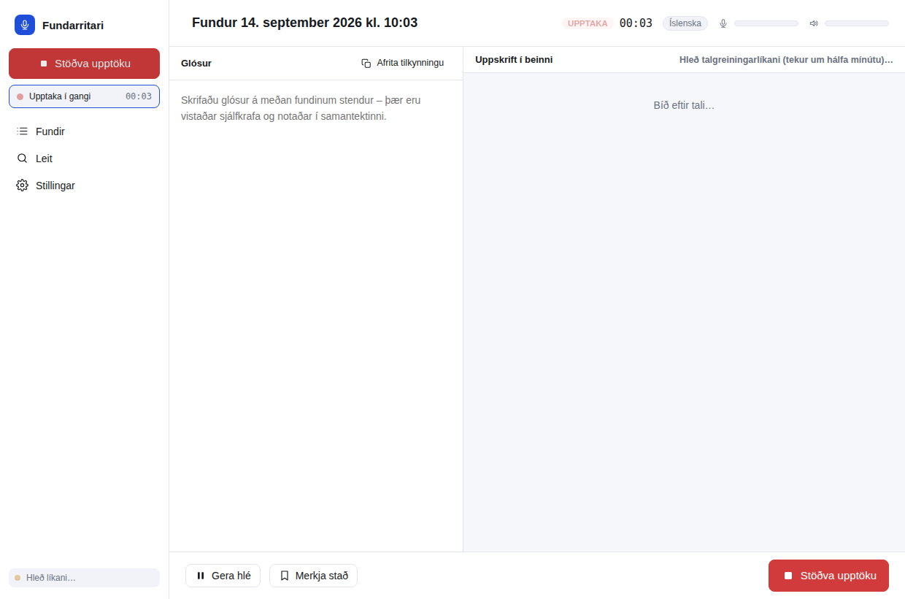
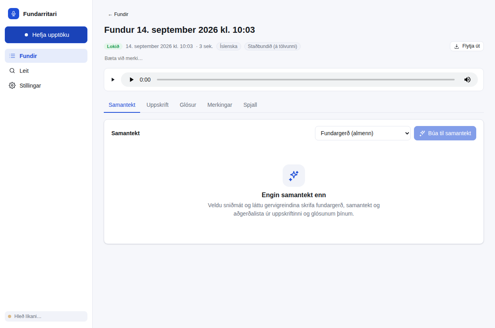
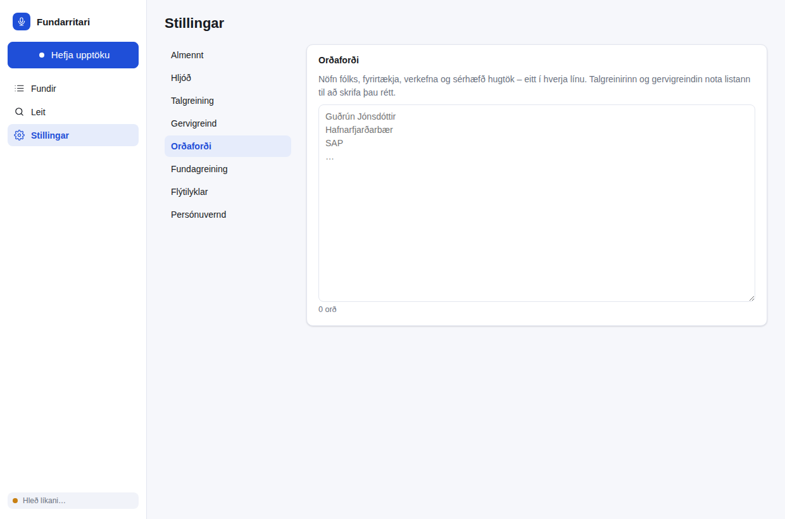

# Fundarritari – leiðbeiningar fyrir prófendur

Fundarritari er forrit sem **skrifar niður allt sem sagt er á fundum, á íslensku**. Það virkar með Microsoft Teams,
Zoom, Google Meet og öðrum fundarforritum – og líka á venjulegum fundum í herbergi. Enginn „bot“ bætist við fundinn;
forritið hlustar bara á tölvuna þína. Þegar fundinum lýkur færðu uppskrift af öllu sem var sagt, hver sagði hvað,
og tilbúna fundargerð með samantekt, ákvörðunum og verkefnalista.

Þessar leiðbeiningar eru fyrir **Windows** (algengast með Teams). Neðst eru leiðbeiningar fyrir **Mac**.

---

## 1. Sækja forritið

Opnaðu þennan hlekk í vafra (hann sækir alltaf nýjustu útgáfuna):

**https://github.com/einarorn228/meeting-notes/releases/latest/download/Fundarritari-Setup-win-x64.exe**

Ef þú fékkst skrána senda sem viðhengi í staðinn er það sama skráin — haltu bara áfram í næsta kafla.

Skráin heitir `Fundarritari-Setup-win-x64.exe` og er um 190 MB. Hún vistast venjulega í möppuna *Downloads* (Niðurhal).

> Ef vafrinn segir að skráin sé „ekki algeng“ eða „gæti verið hættuleg“, veldu **Keep** (Halda) → **Keep anyway**.
> Þetta gerist með öll ný forrit sem ekki eru frá stórum fyrirtækjum og er eðlilegt.

## 2. Setja upp

1. Tvísmelltu á skrána `Fundarritari-Setup-win-x64.exe` (í möppunni *Downloads*).
2. Ef bláa glugginn **„Windows protected your PC“** (Windows varði tölvuna þína) birtist:
   smelltu á **More info** (Nánari upplýsingar) og svo **Run anyway** (Keyra samt).
3. Fylgdu uppsetningarglugganum: **Next → Next → Install → Finish**. Þú mátt hafa allt á sjálfgefnum stillingum.
4. Fundarritari opnast sjálfkrafa og flýtileið birtist á skjáborðinu.

> **Ertu þegar með eldri útgáfu?** Þú þarft **ekki** að eyða henni fyrst. Keyrðu bara nýju skrána yfir –
> uppsetningin skiptir út gömlu útgáfunni og heldur öllum stillingum, fundum og líkönum. Eftir þessa
> uppsetningu sér forritið sjálft um uppfærslur (sjá kafla 8).

## 3. Fyrsta ræsing – uppsetningarhjálpin (tekur 2–3 mínútur)

Þegar forritið opnast í fyrsta sinn leiðir það þig í gegnum sjö einföld skref. Smelltu á **Byrjum →** og svo **Áfram →**
milli skrefa.



| Skref | Hvað á að gera |
|---|---|
| **1. Velkomin** | Tungumál viðmóts: *Íslenska*. Smelltu á **Byrjum**. |
| **2. Hljóðnemi** | Smelltu á **Veita aðgang að hljóðnema**. Ef Windows spyr hvort forritið megi nota hljóðnemann, veldu **Já / Allow**. |
| **3. Kerfishljóð** | Á Windows þarf ekkert að gera – forritið heyrir sjálfkrafa hljóðið úr Teams. Smelltu á **Áfram**. |
| **4. Prófun** | Spilaðu eitthvað með hljóði á tölvunni (t.d. myndband á YouTube) og smelltu á **Hefja prófun**. Talaðu í hljóðnemann. Eftir 4 sekúndur eiga **báðir** mælarnir (Hljóðnemi og Kerfishljóð) að hafa hreyfst. Ef „Kerfishljóð“ hreyfist ekki, sjá kaflann *Ef eitthvað virkar ekki* neðar. |
| **5. Talgreining** | Hafðu *Íslenska* og *Staðbundið (á tölvunni)*. Þá fer ekkert af fundinum út af tölvunni. |
| **6. Gervigreind** | Þetta skref er valfrjálst. Ef þú fékkst sendan **lykil** (langur texti sem byrjar á `sk-ant-`), veldu *Anthropic (Claude)* og límdu lykilinn í reitinn. Þá fást sjálfvirkar fundargerðir. Annars smelltu á **Sleppa**. |
| **7. Tilbúið** | Smelltu á **Opna Fundarritara**. |











**Mikilvægt:** Í fyrsta skipti þarf forritið að sækja íslenska talgreiningarlíkanið (um 3 GB). Það gerist
sjálfkrafa í bakgrunni og getur tekið **5–20 mínútur** eftir nettengingu. Neðst til vinstri í glugganum sérðu
stöðuna: *„Sæki líkan…“* → *„Hleð líkani…“* → **„Tilbúið“**. Þú getur skoðað framvinduna nánar undir
**Stillingar → Talgreining**. Bíddu eftir **„Tilbúið“** áður en þú tekur upp fyrsta fundinn.



## 4. Að taka upp fund

1. Opnaðu Teams (eða Zoom o.s.frv.) og farðu inn á fundinn eins og venjulega.
2. Opnaðu Fundarritara og smelltu á bláa hnappinn **Hefja upptöku** (efst til vinstri).
   Flýtileið: haltu inni **Ctrl + Shift + R** hvar sem er í tölvunni.
   *Ábending:* Fundarritari lætur þig sjálfur vita með tilkynningu þegar hann sér að Teams er í gangi.
3. Upptökuglugginn opnast:
   - Efst: heiti fundar (þú mátt skrifa nýtt), klukka og tveir **mælar** – annar fyrir þína rödd, hinn fyrir hljóðið úr fundinum. Báðir eiga að hreyfast þegar talað er.
   - Vinstra megin: **Glósur** – þú mátt skrifa punkta á meðan fundinum stendur. Þeir eru notaðir í fundargerðina.
   - Hægra megin: **Uppskrift í beinni** – textinn birtist nokkrum sekúndum eftir að hvert innlegg er sagt. Þín innlegg eru merkt **Ég**, hinna **Aðrir**.
   - **Merkja stað** (eða **Ctrl + Shift + H**): merkir mikilvægt augnablik sem auðvelt er að finna síðar.
   - **Afrita tilkynningu**: afritar setningu sem þú getur límt í spjall fundarins til að láta aðra vita að fundurinn sé skrifaður niður. Það er kurteisi (og skylda samkvæmt persónuverndarreglum) að segja fólki frá þessu.
4. Þú mátt lágmarka gluggann eða loka honum – upptakan heldur áfram. Forritið er þá í **kerfisbakkanum** (litla táknið neðst til hægri á skjánum, við klukkuna). Þar geturðu líka stöðvað upptökuna.
5. Þegar fundinum lýkur: smelltu á rauða hnappinn **Stöðva upptöku**.




**Textinn kemur með smá töf – það er eðlilegt.** Forritið bíður eftir að þú ljúkir setningunni (það þarf heila
setningu til að skrifa rétta íslensku) og skrifar hana svo upp. Stutt andartaksþögn í miðri setningu telst ekki
sem setningalok: forritið leyfir tæpa sekúndu af þögn áður en það klippir, svo setningin komi heil. Á meðan sérðu línu með tímanum, nafninu þínu og
þremur punktum sem hreyfast – það þýðir *„þetta heyrðist og er í vinnslu“*. Þegar textinn er tilbúinn kemur hann
í staðinn fyrir punktana.

Á tölvu án skjákorts tekur hver stök setning lengri tíma en að segja hana. Þegar setningar safnast upp
vinnur forritið nokkrar þeirra saman í einu – það er miklu fljótara – og þá birtist textinn í lengri bútum
(nokkrar setningar í einni línu). Uppi í hægra horninu á uppskriftinni sést hversu langt á eftir textinn er,
til dæmis *„Uppskrift er ~20 sek á eftir tali“*; það er eðlilegt ástand og talan á að haldast svipuð út
fundinn. Fari hún yfir tvær mínútur segir forritið að uppskriftin klárist eftir fundinn. Fundurinn tapast
ekki: forritið heldur áfram að skrifa eftir að þú stöðvar upptökuna, og línurnar með punktunum sjást líka á
fundarsíðunni undir **Uppskrift** á meðan.

Til viðmiðunar: í prófun á venjulegri fjögurra kjarna tölvu, á klukkutíma samtali tveggja manns þar sem talað
var nánast stanslaust, hélst textinn um 13 sekúndum á eftir talinu allan fundinn og bunkinn stækkaði ekki.

## 5. Eftir fundinn

Þegar þú stöðvar opnast fundurinn sjálfkrafa. Forritið vinnur úr honum í nokkrar mínútur (staðan sést efst):

1. **Greini ræðumenn** – raddir hinna þátttakendanna eru aðgreindar og hver fær sitt merki: *Þátttakandi 1, 2, 3…*
2. **Laga greinarmerki** – (aðeins ef gervigreindarlykill var settur inn).
3. **Skrifa samantekt** – fundargerðin verður til (aðeins með gervigreindarlykli).

Flipar fundarins:

- **Samantekt** – fundargerð: samantekt, helstu atriði, ákvarðanir og aðgerðir með ábyrgðaraðila. Veldu annað sniðmát (t.d. *Stöðufundur* eða *Stjórnarfundur*) og smelltu á **Endurgera** ef þú vilt annað snið.
- **Uppskrift** – allt sem var sagt, með tímastimplum. **Smelltu á tíma** til að hlusta á nákvæmlega þann stað.
  **Smelltu á nafn ræðumanns** (t.d. „Þátttakandi 2“) til að gefa honum rétt nafn – þá breytist það alls staðar.
  Tvísmelltu á texta til að leiðrétta hann.
- **Glósur**, **Merkingar** og **Spjall** (spurðu t.d. „Hvað var ákveðið um fjárhagsáætlunina?“ – þarf gervigreindarlykil).
- **Flytja út** (efst til hægri): vistaðu fundargerðina sem **Word**, **PDF**, Markdown eða texta til að senda öðrum.

Á forsíðunni (**Fundir**) sérðu alla fundi og getur leitað í þeim öllum í einu.



## 6. Góð ráð fyrir bestu nákvæmni

- **Notaðu heyrnartól** (helst með snúru). Þá blandast rödd hinna ekki inn í hljóðnemann þinn og allir fá rétt merki.
- **Bluetooth-heyrnartól** geta valdið því að „Kerfishljóð“-mælirinn stendur kyrr. Ef það gerist: veldu heyrnartólin sem hljóðúttak í Windows *áður* en fundurinn hefst, eða notaðu hátalara tölvunnar.
- Skráðu **nöfn fólks og fagorð** undir **Stillingar → Orðaforði** (eitt í hverja línu). Þau eru þá skrifuð rétt í uppskriftinni og í fundargerðinni.
- **Ensk orð inni í íslensku tali** („up to speed“, heiti á forritum) eru skrifuð eins og þau hljóma – talgreiningarlíkanið kann aðeins íslensku. Gervigreindin lagar þau eftir á þegar samhengið er ótvírætt. Settu ensku orðin sem þið notið í **Orðaforða**, þá rata þau rétt inn.


- Fyrsta skiptið sem talgreiningin fer í gang eftir að tölvan er ræst tekur hún um hálfa mínútu að hlaða líkaninu. Ræstu Fundarritara nokkrum mínútum fyrir fund.
- Á hægum tölvum getur uppskriftin dregist aðeins aftur úr talinu. Það er í lagi – allt kemur að lokum, og allt hljóðið er geymt.

## 7. Ef eitthvað virkar ekki

| Vandamál | Lausn |
|---|---|
| „Kerfishljóð“-mælirinn hreyfist ekki / aðeins mín rödd er skrifuð | Athugaðu að Teams spili hljóðið í sama tæki og Windows notar sem *sjálfgefið hljóðúttak* (hægrismelltu á hátalaratáknið við klukkuna → *Sound settings*). Prófaðu aftur undir **Stillingar → Hljóð → Prófa upptöku**. |
| Windows spyr um leyfi fyrir hljóðnema en ég ýtti á Nei | *Settings → Privacy & security → Microphone* → kveiktu á „Let desktop apps access your microphone“. |
| Neðst til vinstri stendur „Villa“ eða „Ekki uppsett“ | Farðu í **Stillingar → Talgreining** og smelltu á **Setja upp þjónustu** og svo **Sækja líkan**. |
| Villa um `cublas64_12.dll` eða annað skjákorts-bókasafn | Forritið prófar nú skjákortið áður en fundur hefst og skiptir sjálfkrafa yfir á örgjörvann ef það virkar ekki. Uppfærðu í nýjustu útgáfu. |
| Villa um „float16 compute type“ þegar líkan er hlaðið | Forritið velur nú sjálft rétta stillingu fyrir tölvuna; uppfærðu í nýjustu útgáfu. Þarftu lausn strax: **Stillingar → Talgreining** → settu **Tæki** á `cpu` og **Reiknigerð** á `int8`, og smelltu svo á **Hlaða líkani**. |
| „Hleð líkani…“ stendur mjög lengi og ekkert er skrifað á fundi | Uppfærðu í nýjustu útgáfu – í 0.1.5 og 0.1.6 gat hleðslan tekið margar mínútur og upptakan beið á meðan. Í nýrri útgáfum tekur hún hálfa til eina mínútu og sýnir hvaða vél er notuð („Hleð talgreiningarlíkani á cpu/int8…“). |
| Fundargerðin segir „Þátttakandi 1“ þótt ég hafi gefið viðkomandi nafn | Frá og með 0.1.14 færist nafnið sjálfkrafa inn í fundargerðina um leið og þú nefnir ræðumanninn. Í eldri fundargerðum stendur gamla merkingin; smelltu á **Búa til fundargerð** aftur til að fá hana uppfærða. |
| Ég nenni ekki að skrifa sömu nöfnin í hvert sinn | Smelltu á ræðumanninn í uppskriftinni – undir reitnum eru nöfnin sem þú hefur notað áður, og þeir sem boðaðir voru á fundinn ef hann kom úr dagatalinu. Eitt klikk setur nafnið inn. |
| Sama manneskjan er merkt sem „Þátttakandi 2, 3, 4…“ | Forritið giskaði á of marga ræðumenn (átti að lagast í 0.1.11). Opnaðu fundinn → **Uppskrift** → **Ræðumenn…** og sláðu inn hversu margir töluðu hinum megin (t.d. `1` ef þú talaðir við eina manneskju). Þá er greiningin keyrð aftur með réttum fjölda. |
| „Ræðumenn…“ segir að hljóðupptakan sé ekki geymd | Ræðumannagreining þarf hljóðskrá fundarins. Kveiktu á **Stillingar → Almennt → Geyma hljóðskrár** fyrir næstu fundi (eldri fundir án hljóðs er ekki hægt að greina aftur). |
| Ensk orð koma út sem bull („vorm kittí“, „ýkja forritinu“) | Íslenska líkanið kann ekki ensku og skrifar hana eins og hún hljómar. Frá 0.1.15 leiðréttir gervigreindin slík orð þegar samhengið segir ótvírætt hvað var sagt, og orð úr **Stillingar → Orðaforða** rata rétt inn. Sé fundurinn að mestu á ensku má velja fjöltyngt líkan í **Stillingar → Talgreining** – það kann ensku en er miklu ónákvæmara á íslensku. |
| Þrír punktar „…“ birtast í uppskriftinni | Þar náði talgreinirinn ekki því sem sagt var (oftast hlátur, tal ofan í hvort annað eða enska). Fram að 0.1.15 stóð þarna orðið „unk“. |
| Uppskriftin varð verri eftir að ég fyllti út orðaforðann | Lagað í 0.1.13. Í eldri útgáfum var listinn sendur inn í talgreininn sjálfan og gat ruglað hann (orð féllu út, vinnslan varð margfalt hægari). Uppfærðu – eða tæmdu listann þangað til. Eftir uppfærslu lagar listinn stafsetningu nafna eftir á, sem virkar. |
| Heyrnartólin (eða hljóðneminn) duttu út í miðjum fundi | Forritið tekur eftir því, lætur þig vita og reynir að ná sambandi við sama tæki aftur í allt að tvær mínútur. Upptakan heldur áfram á meðan; það sem vantaði verður þögn á réttum stað í upptökunni. |
| Talgreiningin datt út í miðjum fundi | Forritið ræsir hana aftur sjálft (fimm tilraunir) og segir frá því. Upptakan heldur áfram allan tímann; það sem sagt var á meðan hún var niðri vantar í uppskriftina, en þú getur skrifað fundinn upp úr hljóðinu eftir á með **Endurrita**. Gerist þetta oft er tölvan líklega minnislaus – prófaðu minna líkan í **Stillingar → Talgreining**. |
| Fundur stendur „Stöðvaðist“ | Forritið lokaðist eða tölvan slökkti á sér í miðjum fundi. Hljóðið sem náðist er varðveitt: opnaðu fundinn og smelltu á **Ljúka uppskrift** – þá er uppskriftin skrifuð úr hljóðskránni. |
| Ekkert gerist í langan tíma eftir að ég stöðva | Stór fundur á hægri tölvu getur tekið nokkrar mínútur í vinnslu. Skildu forritið eftir opið. |
| Samantekt verður ekki til | Það þarf gervigreindarlykil: **Stillingar → Gervigreind** → *Anthropic (Claude)* → límdu lykilinn → **Prófa tengingu**. |
| Ég vil byrja upp á nýtt | **Stillingar → Persónuvernd → Opna möppu** – þar eru allir fundir sem möppur. Það má eyða þeim. |

## 8. Uppfærslur – forritið uppfærir sig sjálft

Þú þarft **ekki** að sækja nýja útgáfu handvirkt eftir þessa uppsetningu.

- Forritið athugar sjálft hvort ný útgáfa sé komin (við ræsingu og einu sinni á dag) og **sækir hana í bakgrunni**.
- Þegar hún er tilbúin birtist blá lína efst í glugganum: *„Ný útgáfa er tilbúin“* með takkanum **Endurræsa núna**.
  Smelltu á hann þegar þér hentar. Forritið lokast, uppfærir sig þegjandi á nokkrum sekúndum og opnast aftur
  sjálft – þú þarft ekki að svara neinum uppsetningarglugga. Öll gögnin þín haldast óbreytt.
- Þú getur líka leitað sjálf(ur): **Stillingar → Almennt → Uppfærslur → Leita að uppfærslum**.
- Viltu ráða þessu alveg sjálf(ur)? Slökktu á **Uppfæra sjálfkrafa** á sama stað. Þá leitar forritið aldrei
  af sjálfu sér, en hnappurinn *Leita að uppfærslum* virkar áfram þegar þú vilt.
- Ef upptaka er í gangi neitar forritið að endurræsa sig. Stöðvaðu upptökuna fyrst.

Á Mac uppfærir forritið sig ekki sjálft; þar lætur það þig vita og þú sækir nýju útgáfuna með einum smelli.

## 9. Hvað verður um gögnin?

Allt – hljóðupptökur, uppskriftir og fundargerðir – er geymt **á þinni tölvu** (`C:\Users\<þú>\AppData\Roaming\Fundarritari\data`).
Ekkert fer á netið nema þú veljir gervigreindarþjónustu (Claude) fyrir samantektir; þá er textinn (ekki hljóðið) sendur
til Anthropic til að skrifa fundargerðina. Þú getur eytt fundi (og hljóðskrá) hvenær sem er inni í forritinu.

---

## Mac (macOS 14 eða nýrra)

1. Sæktu `Fundarritari-Setup-mac-arm64.dmg` (nýrri Mac með Apple-örgjörva, M1–M5) eða `Fundarritari-Setup-mac-x64.dmg` (eldri Intel-Mac) af https://github.com/einarorn228/meeting-notes/releases/latest
   Ef þú veist ekki hvort: Apple-valmynd → *About This Mac* → „Chip: Apple M…“ = arm64.
2. Opnaðu `.dmg`-skrána og dragðu **Fundarritari** yfir í **Applications**.
3. Forritið er ekki „notarized“ hjá Apple í þessari prófunarútgáfu, svo macOS neitar að opna það í fyrsta sinn. Gerðu þá þetta **einu sinni**:
   opnaðu *Terminal* (leitaðu að „Terminal“ með ⌘ + bilslá) og límdu inn:
   ```
   xattr -cr /Applications/Fundarritari.app
   ```
   ýttu á Enter og opnaðu forritið úr Applications. Ef enn kemur viðvörun: *System Settings → Privacy & Security* → neðst **Open Anyway**.
4. Í uppsetningarhjálpinni biður macOS um tvær heimildir: **Microphone** og **System Audio Recording** (eða *Screen & System Audio Recording* á eldri macOS). Veldu **Allow** í báðum. Ef kerfishljóð virkar ekki eftir það, lokaðu forritinu og opnaðu aftur.
5. Flýtilyklar á Mac: **⌘ + Shift + R** (hefja/stöðva) og **⌘ + Shift + H** (merkja stað). Að öðru leyti er allt eins og að ofan.

---

## Hvað viljum við vita eftir prófunina?

1. Gekk uppsetningin (kaflar 1–3) snurðulaust? Hvar stoppaðirðu, ef eitthvað?
2. Hreyfðust báðir mælarnir í prófuninni?
3. Hversu vel var íslenskan skrifuð upp? Nöfn? Tölur? Hvað var rangt?
4. Voru þátttakendur rétt aðgreindir?
5. Var fundargerðin gagnleg? Hvað vantaði?
6. Hvað fannst þér óþægilegt eða ruglandi í forritinu?

Takk fyrir að prófa!
